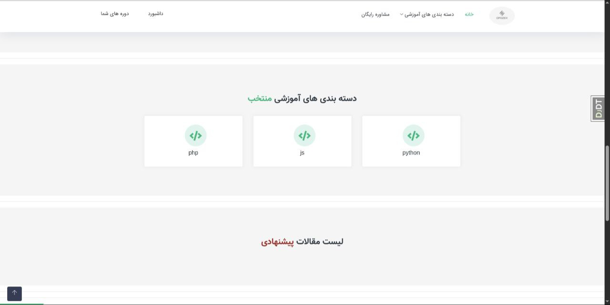
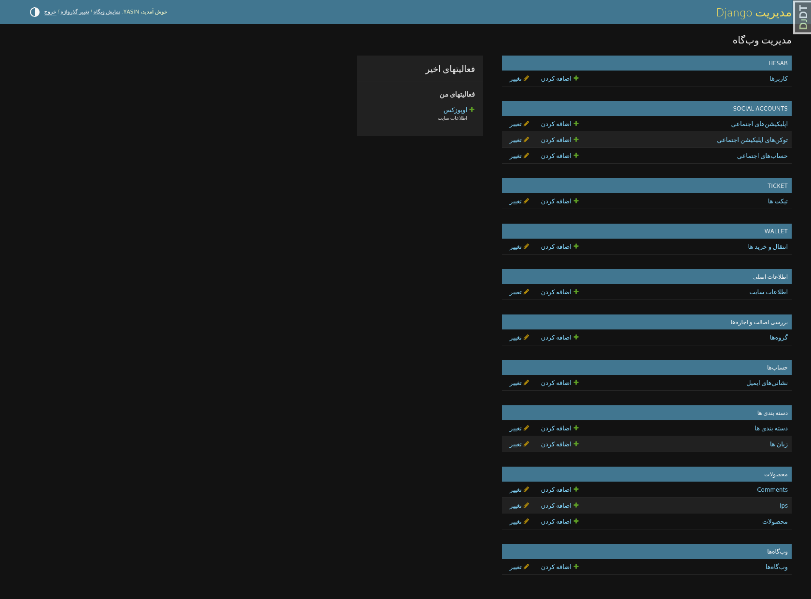
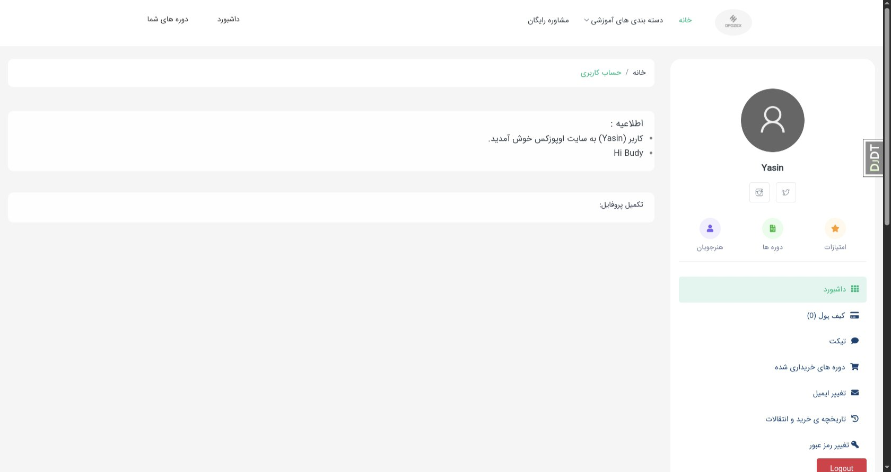

# 👋 Welcome to spsh

spsh2 is a comprehensive e-commerce platform built with Django that supports both physical and digital product sales. It features an integrated wallet system so that users can recharge their wallet and make purchases seamlessly.
## If you like the project, give it a star.
---

## Demo
### Home page :

### Category page :

### Filter page :

### Admin page :

### Dashboard page :

### Models :

---

## Todo:

- update ticket
- response ticket ui
- signin with google
